# Установка и обновления системы Linux. Основы администрорования.
---
## Part 1. Уcтановка ОС
---
- Узнаем версию Ubuntu через команду: `cat /etc/issue`
- 
---
## Part 2. Создание польлзователя
---
- Добавим нового пользователя с помощью команды `sudo useradd -m lev` и добавим его в группу adm с помощью команды: `sudo usermod -aG adm lev`:
- 

- Проверим, что пользователь добавлен в группу adm с помощью команды `cat /etc/passwd`:
- 
---
## Part 3. Настройка сети ОС
---
-Зададим название машины вида user-1. Для этого изменим содержимое файла `/etc/hostname`. И проверим изменение командой: `uname -n`:
- 
- Далее установим временную зону, соответствующую своему текущему местополежению:
- Для этого воспользуемся командой: `sudo timedatectl set-timezone Europe/Moscow`
- 
- Далее с помощью команды `ip a` выведем все сетевые интерфейсы:
- 
- Дадим объяснение для чего нужен интерфейс lo:
- lo (loopback device) – виртуальный интерфейс, присутствующий по умолчанию в любом Linux. Он используется для отладки сетевых программ и запуска серверных приложений на локальной машине. С этим интерфейсом всегда связан адрес 127.0.0.1. У него есть dns-имя – localhost.
- С помощью команды `ip a` узнаем выданный при загрузки системы ip адрес для локальной машины:
- 
- Дадим расшифровку DHCP:
- англ. Dynamic Host Configuration Protocol — протокол динамической настройки узла
- С помощью команды `ip r` выведем выведем внутренний ip-адрес:
- 
- Зададим статические настройки ip, gw, dns:
- Для этого изменим файл `/etc/netplan/00-installer-config.yaml`:
- 
- addresses - мой ip-адрес
- gateway4 - шлюз (мой маршрутизатор)
- nameservers - dns сервера ...
- После перезагрузки видим изменненные адреса:
- 
- Пропингуем удаленные хосты 1.1.1.1 и ya.ru:
- Пингуем с помощью команды: `ping адрес`:
- 
---
## Part 4. Обновление ОС
---
- С помощью команды `sudo apt update` обновим индексы репозиториев для пакетов:
- 
- С помощью команды `sudo apt dist-upgrade` обновим системные пакеты:
- 
---
## Part 5. Использование команды **sudo**
---
- С помощью команды `sudo usermod -aG sudo lev` добавим пользователя lev в группу sudo:
- 
- Поменяем hostname ОС от имени пользователя lev: 
- Для этого зайдем через пользователя lev
- Через команду `sudo hostnamectl set-hostname user-2` установим новое имя машины:
- 
---
## Part 6. Установка и настрйока службы времени
---
- Чтобы каждый раз не настраивать время, необходимо настроить службу синхронизации времени. 
- Для этого установим синхронизатор времени NTP:
- Для этого введем: `sudo apt install NTP`.
- После этого откроем файл `vim /etc/ntp.conf` и запишем в него следующее:
- 
- Раскоментируем строки в файле `vim /etc/systemd/timesyncd.conf`:
- 
- Удалим файлы конфигурации ntp с помощью команды `sudo apt purge ntp`
- После этого выполним следующие команды для настройки ntp: `sudo timedatectl set-ntp true` и `sudo systemctl start systemd-timesyncd`
- После этого проверим, что служба ntp синхронизировалась с помощью команды `timedatectl show`:
- 
---
## Part 7. Установка и использование текстовых редакторов
---
- Установим текстовые редакторы: vim, nano, joe.
- С помощью редактора vim создадим файл, и запишем туда свой никнейм:
- 
- Чтобы закрыть файл и сохранить содержимое, выйдем из режима вставки с помощью `esc`, затем нажмем `:` и введем `wq`.
- Содержимое файла test_vim.txt:
- 
- С помощью редактора nano создадим файл, и запишем туда свой никнейм:

- Чтобы закрыть файл и сохранить содержимое, нажмем `ctrl` + `o`, `enter` затем нажмем `ctrl` + `x`.
- Содержимое файла tets_nano.txt:
- 
- С помощью редактора joe создадим файл, и запишем туда свой никнейм:

- Чтобы закрыть файл и сохранить содержимое, нажмем `ctrl` + `K` + `X`.
- Содержимое файла tets_joe.txt:
- 
- Теперь в эти же файлы с помощью этих же редакторов внесем изменения: вместо никнейма напишем s21 School 21, однако закроем их без сохранения изменений:
- для vim:
- 
- Для того чтобы выйти из vim без сохранения изменений: выйдем из режима вставки с помощью `esc`, затем нажмем `:` и введем `q!`.
- Содержимое файла после выхода из программы:
- 
- для nano:
- 
- Для того чтобы выйти из редактирования без сохранения нажмем `ctrl` + `x` и выберем пункт `no`.
- Содержимое файла test_nano.txt:
- 
- для joe:
- 
- Для того, чтобый выйти из joe без сохранения нажмем: `ctrl` + `c` после чего `y` и `enter`
- Содержимое файла test_joe.txt:
- 
- Далее отредактируем файлы еще раз по предыдущему принципу, а затем продемонстрируем функции поиска и замены слов для каждого редактора:
- для vim: 
- Откроем и отредактируем файл:
- 
- Найдем строку School с помощью: выйдя из режима редактирования, нажмем `/` и напишем искомое слово `School`:
- 
- Для замены слова используем: `:s/School/reverend` - заменит первое вхождение строки. Если необходимо заменить сразу все слова: `:s/School/reverend/g`.
- 
- для nano:
- Откроем и отредактируем файл:
- 
- Для того чтобы выполнить поиск по файлу нажмем сочетание `ctrl` + `w`:
- 
- Для того чтобы выполнить поиск с заменой слова нажмем сочетание `ctrl` + `\`, введем слово которое хотим заменить, нажмем `enter`, введем слова на которое хотим заменить, нажмем `enter` после чего у нас будет выбор заменить только одно слово или все и нажимаем `y`
- 
- joe:
- Откроем файл и отредактируем его:
- 
- Для того, чтобы найти слово, воспользуемся сочетанием: `ctrl` + `K` + `F`, после чего будет запрошен образец поиска, после ввода нажмите `enter`, затем ввести опцию поиска `enter`
- 
- если во время поиска вместо второго нажития `enter` ввести параметр `r` и ввести слово, после чего нажать `enter` и ввести `y`, будет произведена замен на это слово.
- 
---
## Part 8. Установка и базовая настройка сервиса **SSHD**
---
- Сперва установим утилиту Openssh. Для этого в консоле пропишем: `sudo apt install openssh-server -y`.
- Теперь добавим SHH-сервер в автозагрузку: `sudo systemctl enable ssh`:
- 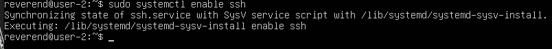
- Проверим работоспособность утилиты и убедимся, что все корректно работает: `ssh localhost`
- 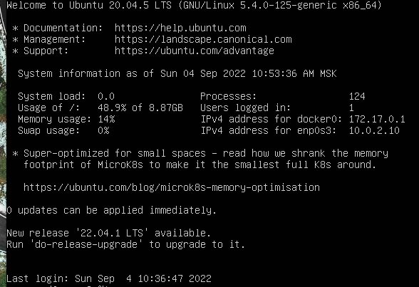
- Теперь изменим порт со стандартного значения 22 на 2022:
- Для этого сперва сделаем резервную копию файла конфигурации: `sudo cp /etc/ssh/sshd_config /etc/ssh/sshd_config.factory-defaults`
- После этого откроем файл /etc/ssh/sshd_config на редактирование, раскомментируем строчку с Port 22 и изменим значение на 2022.
- 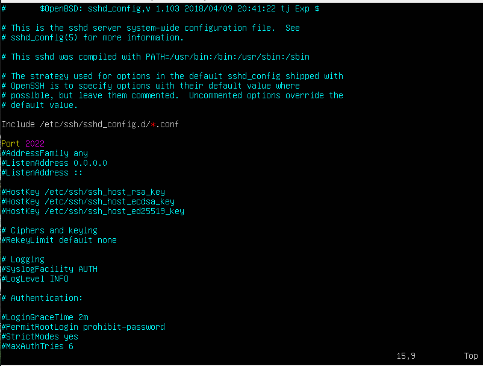
- После сохранения изменений, перезапустим SSH-сервер: `sudo systemctl restart ssh`.
- Теперь, с помощью команды `ps` убедимся, что процесс sshd запущен:
- Для этого введем `ps -d`
- 
- **ps** - Команда ps выводит список текущих процессов на вашем сервере.
- **Ключи для команды ps:**
- A, -e, (a) - выбрать все процессы;
- a - выбрать все процессы, кроме фоновых;
- d, (g) - выбрать все процессы, даже фоновые, кроме процессов сессий;
- -N - выбрать все процессы кроме указанных;
- -С - выбирать процессы по имени команды;
- -G - выбрать процессы по ID группы;
- -p, (p) - выбрать процессы PID;
- --ppid - выбрать процессы по PID родительского процесса;
- -s - выбрать процессы по ID сессии;
- -t, (t) - выбрать процессы по tty;
- -u, (U) - выбрать процессы пользователя.

- Перезагрузим систему: `sudo reboot`.
- Проверим вывод команды `netstat -tan`:
- 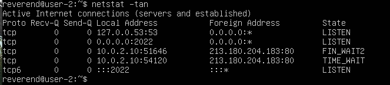
- **Значение столбцов:** 
- Proto: протокол, используемый сокетом.
- Recv-Q: количество байтов, не скопированных пользовательской программой, подключенной к этому сокету.
- Send-Q: количество неподтвержденных байтов удаленного хоста.
- Local Address - локальный адрес (имя локального хоста) и номер порта сокета. Если не указана опция -n, адрес сокета разрешается в соответствии с полным именем хоста (FQDN), а номер порта преобразуется в соответствующее имя службы.
- Foreign Address - удаленный адрес (имя удаленного хоста) и номер порта сокета.
- State - состояние сокета. Поскольку в протоколе RAW нет состояния, а UDP не использует информацию о состоянии, эта строка остается пустой. Обычно это одно из следующих значений: ESTABLISHED, SYN_SENT, SYN_RECV, FIN_WAIT1, FIN_WAIT2, TIME_WAIT, CLOSED, CLOSE_WAIT, LAST_ACK, LISTEN, CLOSING, UNKNOWN.

- **Опции netstat:**
- -a Показывать состояние всех сокетов;
- -o Показывать таймен
- -i Показывает состояние сетевых интерфейсов
- -n Показывать ip адрес, а не сетевое имя
- -r Показать таблицы маршрутизации. При использовании с опцией -s показывает статистику маршрутизации.
- -s Показать статистическую информацию по протоколам. При использовании с опцией -r показывает статистику маршрутизации.
- -f семейство_адресов - Ограничить показ статистики или адресов управляющих блоков только указанным семейством_адресов, в качестве которого можно указывать:inet Для семейства адресов AF_INET, или unix Для семейства адресов AF_UNIX.
- -I интерфейс - Показывать информацию о конкретном интерфейсе.
- -p  - Отобразить идентификатор/название процесса, создавшего сокет (-p, —programs display PID/Program name for sockets).
---
## Part 9. Установка и использование утилит **top**, **htop**.
---
- Воспользуемся командой `top`:
- 
- **uptime** = 25 минут
- **Количество авторизированных пользоватлей** - 1 user
- **Общая загрузка системы**: Средняя загрузка системы за последнюю минуту до запуска команды `top`: 0.00, за последнии 5 минут: 0.00, за последнии 15 минут: 0.00
- Общее количество процессов (total): 101.
- **Загрузка cpu**: 
- 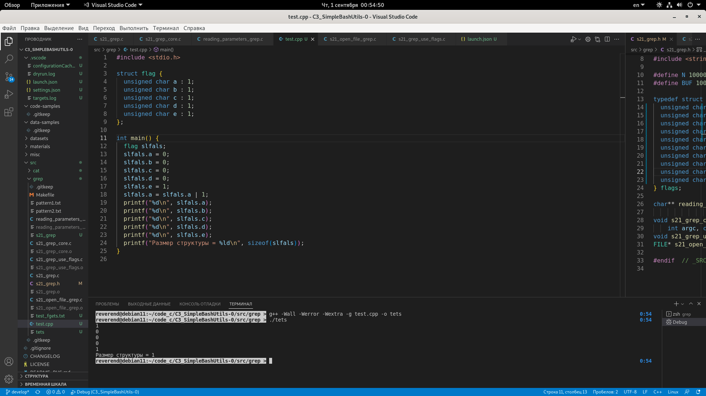
- us — процент времени на выполнение процессов пользователей, для которых не задан приоритет;
- sy — процент времени, на выполнение процессов ядра, использование CPU системой;
- ni — процент времени на выполнение процессов с заданных приоритетом;
- id — «простаивающая» вычислительная мощность;
- wa — процент времени на выполнение операций IO (ввода/вывода), то есть дисковых операций. Чем медленнее диск, тем выше будет значение для каждого процесса;
- hi — процент времени на обработку аппаратных прерываний (на уровне железа);
- si — процент времени на обработку программных прерываний (на уровне программном);
- st — мера загруженности гипервизора;
- **Загрузка памяти:**
- 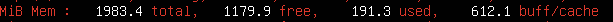
- total — общий объем оперативной памяти;
- used — объем используемой памяти;
- free — объем свободной памяти;
- buffers — объем буфера;
- cached — объем кэша операций ввода/вывода.
- **pid процесса, занимающего больше всего памяти**:
- для этого необходимо нажать сочетание `shift` + `m`:
- 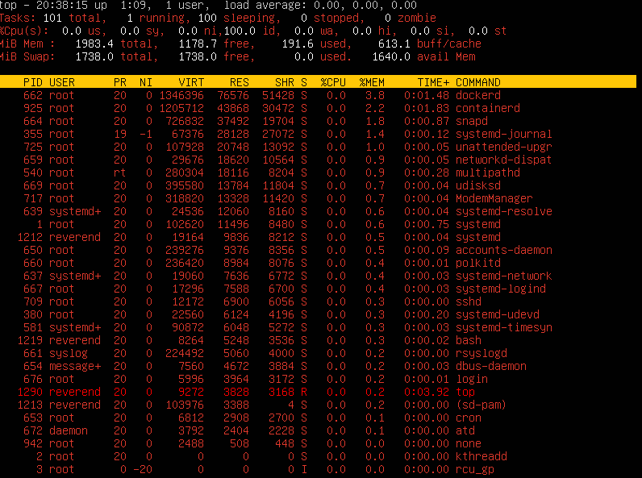
- **pid процесса, занимающего больше всего процессорного времени**:
- для этого необходимо нажать сочетание `shift` + `p`:
- 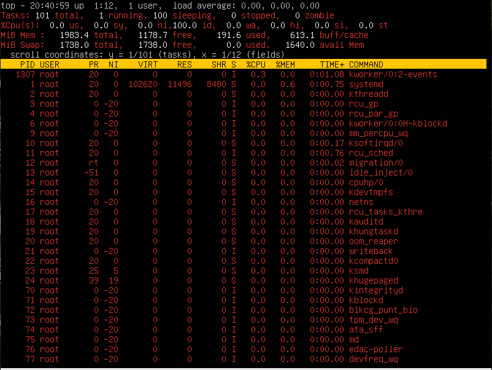
- Воспользуемся командой **htop**:
- Отсортированные процессы по PID:
- 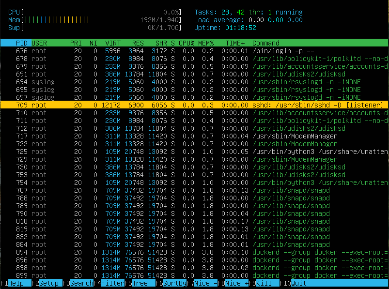
- Отсортированные процессы по PERCENT_CPU:
- 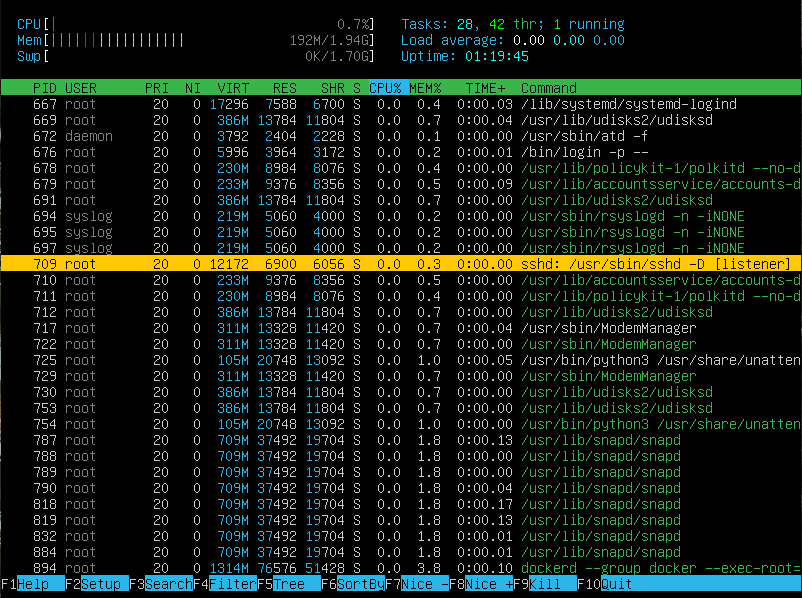
- Отсортированные процессы по PERCENT_MEM:
- 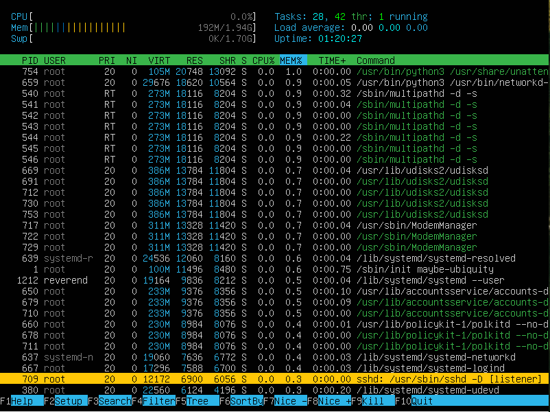
- Отсортированные процессы по TIME:
- 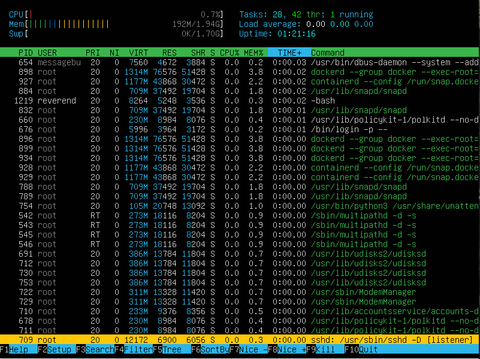
- Отфильтрованный для процесса sshd:
- 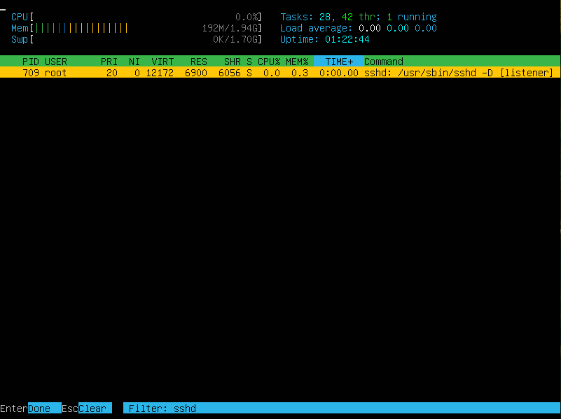
- с процессом syslog, найденным, используя поиск:
- 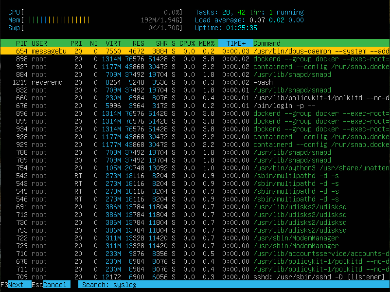
- С добавленным выводом hostname, clock и uptime:
- 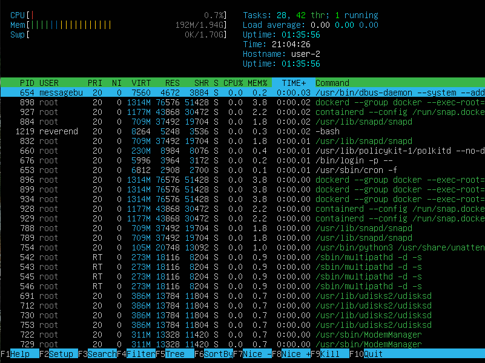
---
## Part 10. Использование утилиты **fdisk**
---
- Запустим команду `fdisk -l`:
- 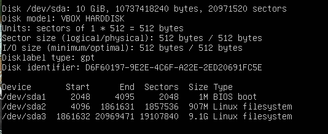
- Название жесткого диска: */dev/sda*, модель: VBOXHARDDISK
- Размер жесткого диска: 10 GiB
- Количество секторов: 20971520
- Размер swap: 907 MB
---
## Part 11. Использование утилиты **df**
---
- **Введем команду `df`**:
- 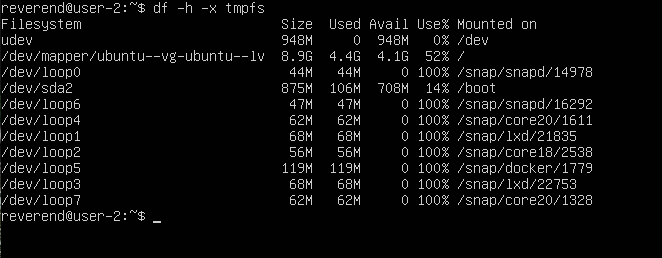
- **Данные для корневого раздела:** 
- Размер раздела: 8.9 G
- Размер занятого пространства: 4.4 G
- Размер свободного пространства: 4.1 G
- Процент использования: 52%
- Единица измерения в выводе: GiB
- **Введем команду `df -Th`**:
- 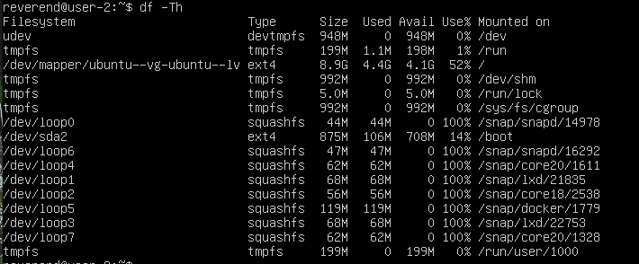
- **Данные для корневого раздела:** 
- Размер раздела: 8.9 G
- Размер занятого пространства: 4.4 G
- Размер свободного пространства: 4.1 G
- Процент использования: 52%
- Тип файловой системы: ext4
---
## Part 12. Использование утилиты **du**
---
- Размер папки **/home** в байтах, человекочитаемом виде:
- 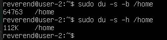
- Размер папаки **/var** в байтах, человекочитаемом виде:
- 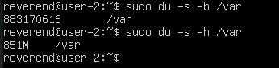
- Размер папаки **/var/log** в байтах, человекочитаемом виде:
- 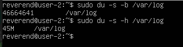
- Размер всего содержимого в **var/log**, с помощью команды `sudo du -a -h /var/log`:
- 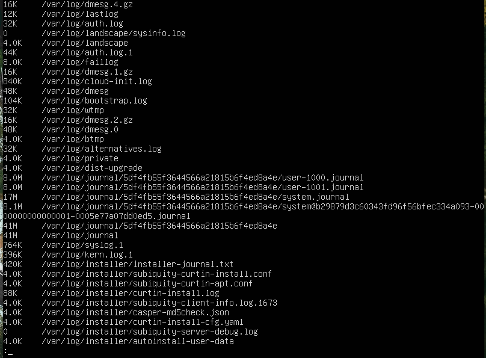
- 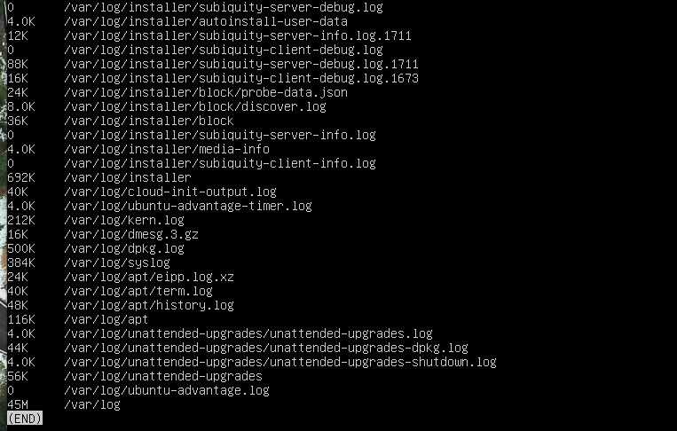
---
## Part 13. Установка и использование утилиты **ncdu**
---
- `ncdu /home`:
- 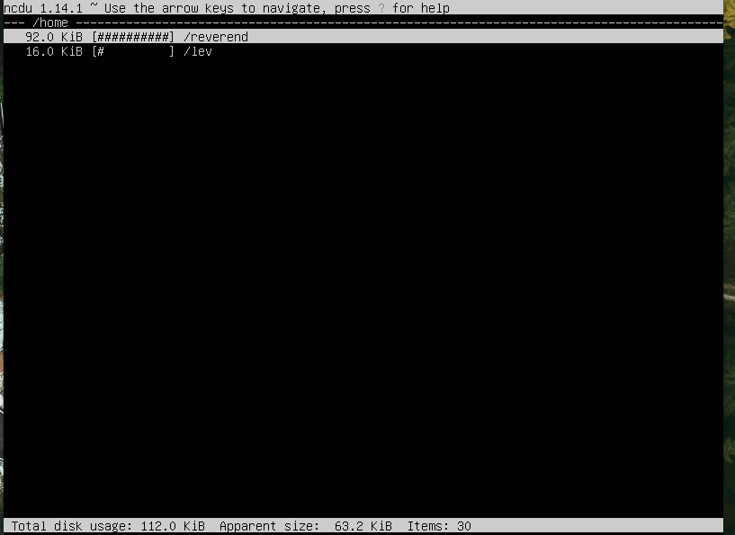
- `ncdu /var`:
- 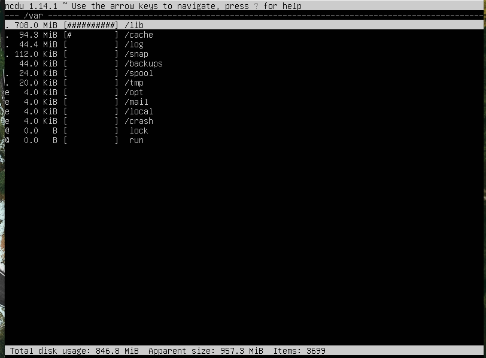
- `ncdu /var/log`:
- 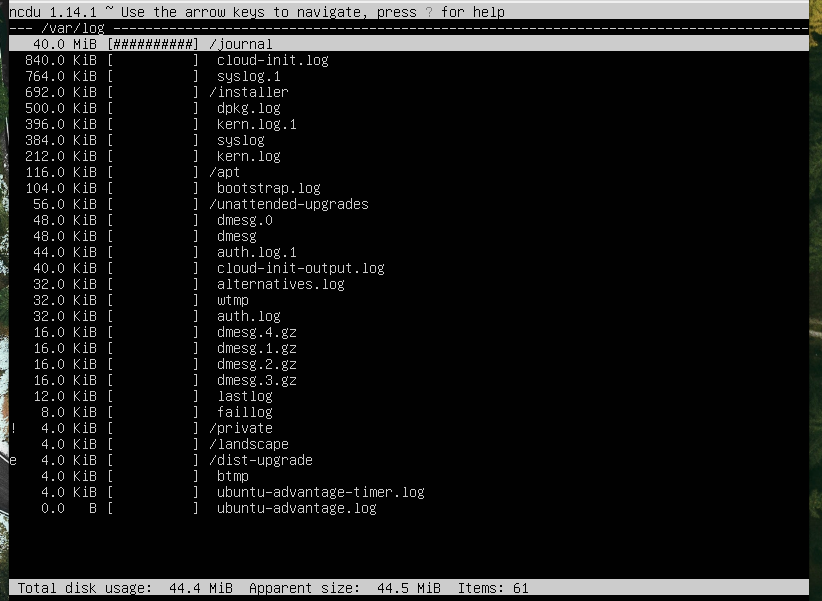
---
## Part 14. Работа с системными журналами
---
- Данные о последней авторизации:
- 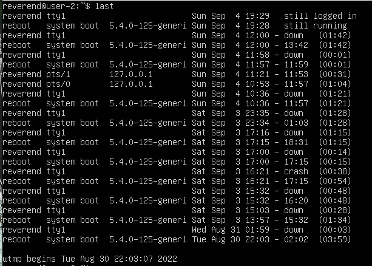
- 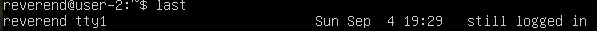
- Данные о рестарте SSHd:
- 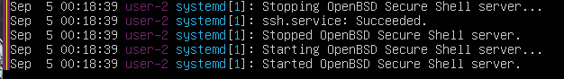
---
## Part 15. Использование планировщика заданий **CRON**
---
- Список текущих заданий для CRON:
- 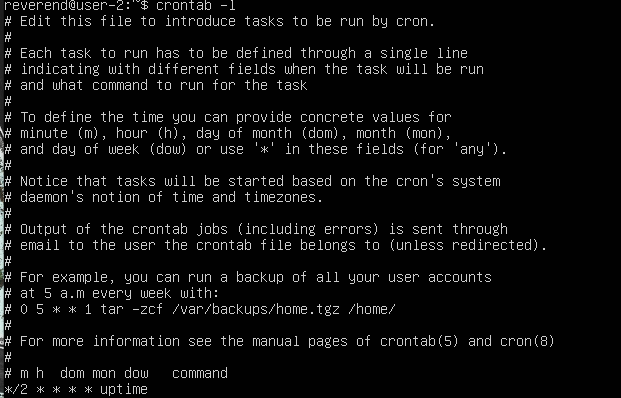
- Информация из системного журнала о выполнении:
- 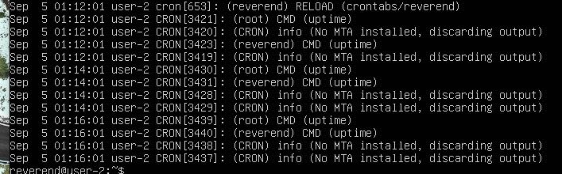
- Пустой список заданий для CRON:
- 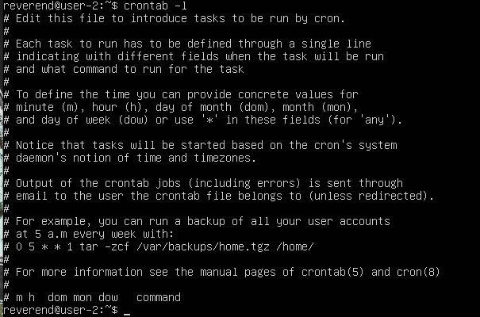