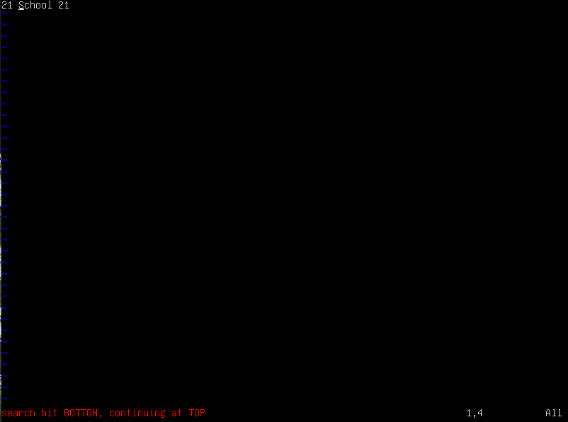

# Установка и обновления системы Linux. Основы администрорования.
---
## Part 1. Уcтановка ОС
---
- Узнаем версию Ubuntu через команду: `cat /etc/issue`
- 
---
## Part 2. Создание польлзователя
---
- Добавим нового пользователя с помощью команды `sudo useradd -m lev` и добавим его в группу adm с помощью команды: `sudo usermod -aG adm lev`:
- 

- Проверим, что пользователь добавлен в группу adm с помощью команды `cat /etc/passwd`:
- 
---
## Part 3. Настройка сети ОС
---
-Зададим название машины вида user-1. Для этого изменим содержимое файла `/etc/hostname`. И проверим изменение командой: `uname -n`:
- 
- Далее установим временную зону, соответствующую своему текущему местополежению:
- Для этого воспользуемся командой: `sudo timedatectl set-timezone Europe/Moscow`
- 
- Далее с помощью команды `ip a` выведем все сетевые интерфейсы:
- 
- Дадим объяснение для чего нужен интерфейс lo:
- lo (loopback device) – виртуальный интерфейс, присутствующий по умолчанию в любом Linux. Он используется для отладки сетевых программ и запуска серверных приложений на локальной машине. С этим интерфейсом всегда связан адрес 127.0.0.1. У него есть dns-имя – localhost.
- С помощью команды `ip a` узнаем выданный при загрузки системы ip адрес для локальной машины:
- 
- Дадим расшифровку DHCP:
- англ. Dynamic Host Configuration Protocol — протокол динамической настройки узла
- С помощью команды `ip r` выведем выведем внутренний ip-адрес:
- 
- Зададим статические настройки ip, gw, dns:
- Для этого изменим файл `/etc/netplan/00-installer-config.yaml`:
- 
- addresses - мой ip-адрес
- gateway4 - шлюз (мой маршрутизатор)
- nameservers - dns сервера ...
- После перезагрузки видим изменненные адреса:
- 
- Пропингуем удаленные хосты 1.1.1.1 и ya.ru:
- Пингуем с помощью команды: `ping адрес`:
- 
---
## Part 4. Обновление ОС
---
- С помощью команды `sudo apt update` обновим индексы репозиториев для пакетов:
- 
- С помощью команды `sudo apt dist-upgrade` обновим системные пакеты:
- 
---
## Part 5. Использование команды **sudo**
---
- С помощью команды `sudo usermod -aG sudo lev` добавим пользователя lev в группу sudo:
- 
- Поменяем hostname ОС от имени пользователя lev: 
- Для этого зайдем через пользователя lev
- Через команду `sudo hostnamectl set-hostname user-2` установим новое имя машины:
- 
---
## Part 6. Установка и настрйока службы времени
---
- Чтобы каждый раз не настраивать время, необходимо настроить службу синхронизации времени. 
- Для этого установим синхронизатор времени NTP:
- Для этого введем: `sudo apt install NTP`.
- После этого откроем файл `vim /etc/ntp.conf` и запишем в него следующее:
- 
- Раскоментируем строки в файле `vim /etc/systemd/timesyncd.conf`:
- 
- Удалим файлы конфигурации ntp с помощью команды `sudo apt purge ntp`
- После этого выполним следующие команды для настройки ntp: `sudo timedatectl set-ntp true` и `sudo systemctl start systemd-timesyncd`
- После этого проверим, что служба ntp синхронизировалась с помощью команды `timedatectl show`:
- 
---
## Part 7. Установка и использование текстовых редакторов
---
- Установим текстовые редакторы: vim, nano, joe.
- С помощью редактора vim создадим файл, и запишем туда свой никнейм:
- 
- Чтобы закрыть файл и сохранить содержимое, выйдем из режима вставки с помощью `esc`, затем нажмем `:` и введем `wq`.
- Содержимое файла test_vim.txt:
- 
- С помощью редактора nano создадим файл, и запишем туда свой никнейм:

- Чтобы закрыть файл и сохранить содержимое, нажмем `ctrl` + `o`, `enter` затем нажмем `ctrl` + `x`.
- Содержимое файла tets_nano.txt:
- 
- С помощью редактора joe создадим файл, и запишем туда свой никнейм:

- Чтобы закрыть файл и сохранить содержимое, нажмем `ctrl` + `K` + `X`.
- Содержимое файла tets_joe.txt:
- 
- Теперь в эти же файлы с помощью этих же редакторов внесем изменения: вместо никнейма напишем s21 School 21, однако закроем их без сохранения изменений:
- для vim:
- 
- Для того чтобы выйти из vim без сохранения изменений: выйдем из режима вставки с помощью `esc`, затем нажмем `:` и введем `q!`.
- Содержимое файла после выхода из программы:
- 
- для nano:
- 
- Для того чтобы выйти из редактирования без сохранения нажмем `ctrl` + `x` и выберем пункт `no`.
- Содержимое файла test_nano.txt:
- 
- для joe:
- 
- Для того, чтобый выйти из joe без сохранения нажмем: `ctrl` + `c` после чего `y` и `enter`
- Содержимое файла test_joe.txt:
- 
- Далее отредактируем файлы еще раз по предыдущему принципу, а затем продемонстрируем функции поиска и замены слов для каждого редактора:
- для vim: 
- Откроем и отредактируем файл:
- 
- Найдем строку School с помощью: выйдя из режима редактирования, нажмем `/` и напишем искомое слово `School`:
- 
- Для замены слова используем: `:s/School/reverend` - заменит первое вхождение строки. Если необходимо заменить сразу все слова: `:s/School/reverend/g`.
- 
- для nano:
- Откроем и отредактируем файл:
- 
- Для того чтобы выполнить поиск по файлу нажмем сочетание `ctrl` + `w`:
- 
- Для того чтобы выполнить поиск с заменой слова нажмем сочетание `ctrl` + `\`, введем слово которое хотим заменить, нажмем `enter`, введем слова на которое хотим заменить, нажмем `enter` после чего у нас будет выбор заменить только одно слово или все и нажимаем `y`
- 
- joe:
- Откроем файл и отредактируем его:
- 
- Для того, чтобы найти слово, воспользуемся сочетанием: `ctrl` + `K` + `F`, после чего будет запрошен образец поиска, после ввода нажмите `enter`, затем ввести опцию поиска `enter`
- 
- если во время поиска вместо второго нажития `enter` ввести параметр `r` и ввести слово, после чего нажать `enter` и ввести `y`, будет произведена замен на это слово.
- 
---
## Part 8. Установка и базовая настройка сервиса **SSHD**
---
